# Procedural Posture Classification — System Architecture

## 1. Overview

This document describes the software architecture of the **Procedural Posture Classification** system: a multi-label text classification pipeline for legal judicial opinions. The system classifies documents into 41 procedural posture labels using two complementary models (TF-IDF baseline and Legal-Longformer transformer) with ensemble capabilities.

### 1.1 Design Principles

| Principle | Implementation |
|-----------|---------------|
| **Separation of Concerns** | 6 dedicated modules: loader, analyzer, trainer, evaluator, bert_trainer, visualization |
| **Dependency Injection** | `DatasetAnalyzer` and `DataPreparer` receive `DataLoader` rather than creating it |
| **Strategy Pattern** | `LongDocumentStrategy` ABC with Truncate / HeadTail / Summarize implementations |
| **Template Method** | `BaseTransformerTrainer.train()` defines the training loop; `_create_model()` is abstract |
| **Facade** | `HybridLegalClassifier` orchestrates `LegalSummarizer` + `LegalLongformerTrainer` |
| **Lazy Loading** | Models and tokenizers loaded on first use (`DataLoader._df`, `LegalSummarizer._model`) |
| **Disk Caching** | `SummaryCache` persists expensive LED summaries to `outputs/summaries/` |

### 1.2 UML Notation Key

| Relationship | Arrow | Mermaid | Meaning |
|---|---|---|---|
| Dependency | dashed, open arrow | `..>` | "uses" |
| Association | solid, open arrow | `-->` | "has reference to" |
| Inheritance | solid, closed arrow | `<\|--` | "extends" |
| Realization | dashed, closed arrow | `<\|..` | "implements abstract" |
| Composition | solid, filled diamond | `*--` | "owns lifecycle" |
| Aggregation | solid, open diamond | `o--` | "has, independent lifecycle" |

---

## 2. Domain Model

The input data consists of legal judicial opinions with nested text and multi-label posture annotations.


### 2.1 Posture Label Relationships


---

## 3. Package / Component Diagram

### 3.1 Data & Analysis Modules

```mermaid
flowchart TB
    subgraph DL_mod["📂 data_loader.py"]
        direction TB
        DL_1([DataLoader])
    end

    subgraph DA_mod["📂 data_analyzer.py"]
        direction TB
        DA_1([DatasetAnalyzer])
        DA_2([DatasetStatistics])
        DA_3([PostureTaxonomy])
    end

    DA_mod -.->|"aggregation"| DL_mod
    DL_mod -->|uses| PD([pandas])
    DA_mod -->|uses| PD

    style DL_mod fill:#2E5090,color:#fff
    style DA_mod fill:#2E5090,color:#fff
```



### 3.2 Baseline Training Module

```mermaid
flowchart TB
    subgraph MT_mod["📂 model_trainer.py"]
        direction TB
        MT_1([TextExtractor])
        MT_2([DataPreparer])
        MT_3([PreparedData])
        MT_4([BaselineTrainer])
    end

    MT_mod -.->|"aggregation"| DL(["📂 data_loader.DataLoader"])
    MT_mod -->|uses| SK([scikit-learn])
    MT_mod -->|uses| PD([pandas])

    style MT_mod fill:#457B9D,color:#fff
```



### 3.3 Transformer Training Module


### 3.4 Evaluation Module


### 3.5 Visualization Module

```mermaid
flowchart TB
    subgraph VZ_mod["📂 visualization.py"]
        direction TB
        VZ_1([COLORS])
        VZ_2([setup_style])
        VZ_3([_add_chart_branding])
        VZ_4([plot_posture_distribution])
        VZ_5([plot_text_length_distribution])
        VZ_6([plot_class_imbalance])
    end

    VZ_mod -.->|"dependency"| DA(["📂 data_analyzer.DatasetStatistics"])
    VZ_mod -->|uses| MP([matplotlib / seaborn])

    style VZ_mod fill:#3D8B6F,color:#fff
```



### 3.6 Module Dependency Overview


---

## 4. Class Diagrams

### 4.1 Data Layer (`data_loader.py` + `data_analyzer.py`)


### 4.2 Baseline Training Layer (`model_trainer.py`)


### 4.3 Transformer Training Layer (`bert_trainer.py`)


### 4.4 Evaluation Layer (`model_evaluator.py`)

```mermaid
classDiagram
    class MultiLabelEvaluator {
        +list~str~ label_names
        +__init__(label_names: list~str~)
        +evaluate(y_true, y_pred) EvaluationResults
        -_compute_per_class_metrics(y_true, y_pred) DataFrame
    }

    class EvaluationResults {
        <<dataclass>>
        +float f1_micro
        +float f1_macro
        +float f1_weighted
        +float f1_samples
        +float precision_micro
        +float precision_macro
        +float recall_micro
        +float recall_macro
        +float hamming_loss
        +float exact_match_ratio
        +DataFrame per_class_metrics
        +list~str~ label_names
        +summary() str
        +get_top_classes(n, metric) DataFrame
        +get_bottom_classes(n, metric) DataFrame
        +get_feasibility_analysis(human_kappa_low, human_kappa_high) DataFrame
    }

    class ModelComparison {
        <<dataclass>>
        +str model1_name
        +str model2_name
        +ndarray y_true
        +ndarray y_pred1
        +ndarray y_pred2
        +list~str~ label_names
        +agreement_matrix() dict
        +per_class_comparison() DataFrame
        +ensemble_predictions(strategy: str) ndarray
    }

    class compute_threshold_analysis {
        <<function>>
        (y_true, y_proba, label_names, thresholds) DataFrame
    }

    class save_predictions {
        <<function>>
        (y_pred, y_proba, filepath) None
    }

    class load_predictions {
        <<function>>
        (filepath) tuple~ndarray, ndarray~
    }

    class create_classification_report_df {
        <<function>>
        (y_true, y_pred, label_names) DataFrame
    }

    MultiLabelEvaluator ..> EvaluationResults : creates
    ModelComparison ..> MultiLabelEvaluator : used alongside
```

---

## 5. Sequence Diagrams

### 5.1 Data Discovery (Notebook 01)


### 5.2 Baseline Modeling (Notebook 02, Part 1)


### 5.3 Transformer Training (Notebook 02, Part 2)


### 5.4 Evaluation & Threshold Optimization (Notebook 03)


### 5.5 Ensemble Analysis (Notebook 04)


---

## 6. Results Summary

### 6.1 Model Performance (Test Set)

| Model | F1 Micro | F1 Macro | Precision | Recall |
|-------|----------|----------|-----------|--------|
| TF-IDF Baseline | 0.752 | 0.533 | 0.648 | 0.897 |
| LF Per-Class Thresholds | 0.774 | 0.600 | 0.712 | 0.847 |
| **Ensemble (AND)** | **0.783** | **0.575** | **0.713** | **0.868** |

### 6.2 Automation Feasibility Tiers

```mermaid
pie title Posture Automation Feasibility (41 classes)
    "Full Automation (F1 ≥ 0.93)" : 1
    "Assisted (0.63 ≤ F1 < 0.93)" : 17
    "Human Review (0.50 ≤ F1 < 0.63)" : 11
    "Manual Only (F1 < 0.50)" : 12
```



| Tier | Classes | Coverage | Action |
|------|---------|----------|--------|
| Full Automation | 1 (Appellate Review) | F1 = 0.95 | Deploy directly |
| Assisted Automation | 12–17 | F1 0.63–0.93 | Model suggests, human reviews |
| Human Review | ~11 | F1 0.50–0.63 | Model assists, human decides |
| Manual Only | ~12 | F1 < 0.50 | Insufficient model confidence |

> ~92% of labeling volume (by sample count) is covered by the automatable + review tiers.
