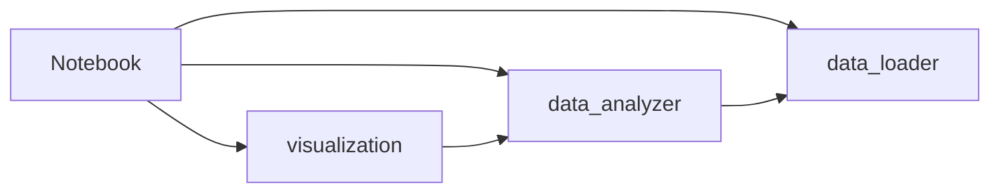
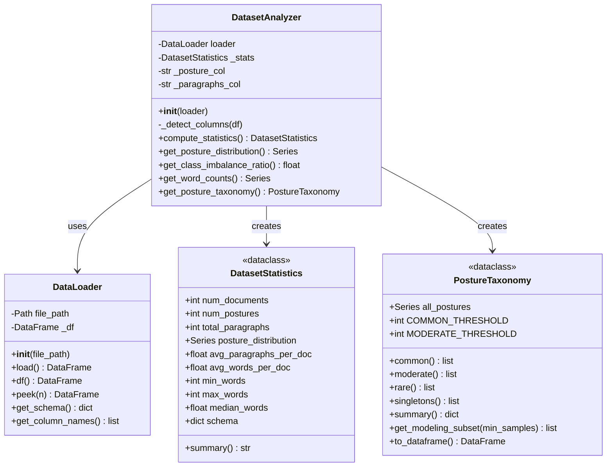
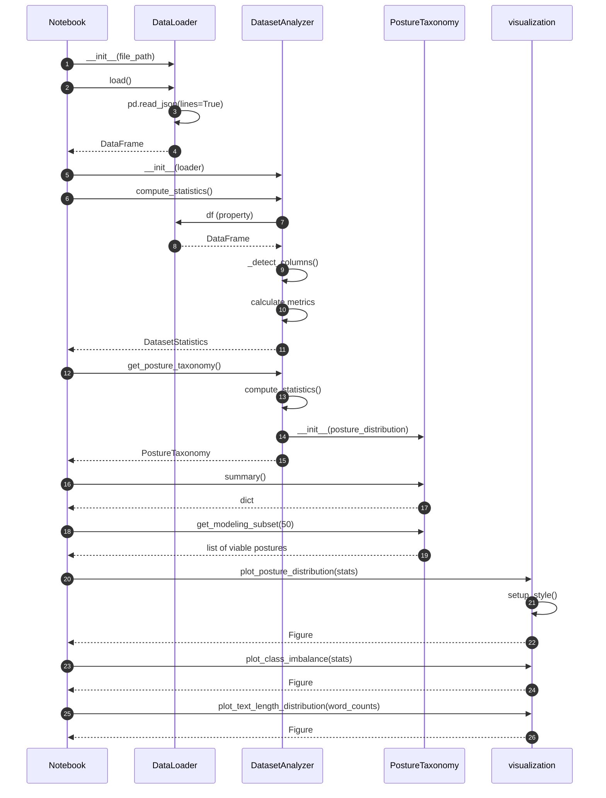

# Data Analysis Architecture

**Thomson Reuters Data Science Challenge - Question 1**

This document describes the architectural choices, main abstractions, and class responsibilities for the data exploration module.

---

## Table of Contents

1. [Design Principles](#design-principles)
2. [Module Overview](#module-overview)
3. [Class Diagram](#class-diagram)
4. [Class Responsibilities](#class-responsibilities)
5. [Sequence Diagram](#sequence-diagram)
6. [Design Decisions](#design-decisions)

---

## Design Principles

The architecture follows these key principles:

| Principle | Implementation |
|-----------|----------------|
| **Separation of Concerns** | Data loading, analysis, and visualization are isolated in dedicated modules |
| **Single Responsibility** | Each class has one clear purpose |
| **Dependency Injection** | `DatasetAnalyzer` receives `DataLoader` rather than creating it |
| **Lazy Evaluation** | Data is loaded and statistics computed only when needed, then cached |
| **Configuration over Hardcoding** | Thresholds and parameters are class attributes, not magic numbers |

---

## Module Overview

```
src/
├── data_loader.py      # Data ingestion layer
├── data_analyzer.py    # Statistical analysis & taxonomy
└── visualization.py    # Professional chart generation
```

### Module Dependencies



---

## Class Diagram



---

## Class Responsibilities

### DataLoader

**Purpose:** Single responsibility for data ingestion from JSON Lines format.

| Method | Description |
|--------|-------------|
| `load()` | Loads entire file into pandas DataFrame (cached) |
| `df` | Property accessor for cached DataFrame |
| `peek(n)` | Preview first n records without loading full data |
| `get_schema()` | Returns column types for data inspection |
| `get_column_names()` | List of available columns |

**Design Rationale:** For a 50MB dataset, streaming is unnecessary overhead. Simple pandas loading is both faster and more maintainable.

---

### DatasetStatistics

**Purpose:** Immutable container (dataclass) for computed metrics.

| Attribute | Description |
|-----------|-------------|
| `num_documents` | Total document count |
| `num_postures` | Count of unique procedural posture labels |
| `total_paragraphs` | Sum of all paragraphs across documents |
| `posture_distribution` | Label frequency Series (sorted) |
| `avg_words_per_doc` | Mean document length |
| `summary()` | Formatted string for display |

**Design Rationale:** Using a dataclass provides:
- Immutability (safer than dicts)
- Type hints for IDE support
- Clean `__repr__` for debugging

---

### DatasetAnalyzer

**Purpose:** Orchestrates all statistical computations from raw data.

| Method | Description |
|--------|-------------|
| `compute_statistics()` | Main entry point - computes all metrics (cached) |
| `get_posture_taxonomy()` | Creates PostureTaxonomy for modeling decisions |
| `get_class_imbalance_ratio()` | Max/min class count ratio |
| `get_word_counts()` | Per-document word counts for visualization |
| `_detect_columns()` | Auto-discovers column names (flexible schema) |

**Design Rationale:** 
- Decoupled from data loading (receives DataLoader via DI)
- Caches computed statistics to avoid redundant processing
- Auto-detects column names to handle schema variations

---

### PostureTaxonomy

**Purpose:** Organizes labels by frequency tiers for ML pipeline decisions.

| Property/Method | Description |
|-----------------|-------------|
| `common` | Labels with ≥100 samples (viable for ML) |
| `moderate` | Labels with 10-99 samples (may need augmentation) |
| `rare` | Labels with <10 samples (candidates for "Other") |
| `singletons` | Labels appearing exactly once |
| `get_modeling_subset(n)` | Labels with ≥n samples |
| `summary()` | Coverage statistics |

**Design Rationale:** Multi-label classification with 224 postures requires principled decisions about which labels to train on. This class encapsulates that logic.

---

## Sequence Diagram



---

## Design Decisions

### 1. DataFrame vs Streaming

**Decision:** Load entire dataset into pandas DataFrame

**Rationale:**
- Dataset is ~50MB (trivial for modern RAM)
- Streaming adds complexity without benefit
- Enables efficient vectorized operations
- Simpler debugging and development

### 2. Multi-Label Handling

**Decision:** Explode `postures` column for frequency analysis

**Rationale:**
- `postures` is a list column (documents can have multiple labels)
- Exploding allows accurate per-label frequency counting
- Original structure preserved in DataFrame for modeling

### 3. Nested Section Parsing

**Decision:** Custom parsers for `sections[].paragraphs[]` structure

**Rationale:**
- Data has nested JSON structure: `[{paragraphs: [...]}, ...]`
- Generic flattening would lose semantic meaning
- Custom parsing counts words and paragraphs accurately

### 4. Frequency Thresholds

**Decision:** Configurable tiers (100/10/1)

| Tier | Threshold | Purpose |
|------|-----------|---------|
| Common | ≥100 | Sufficient samples for standard ML |
| Moderate | 10-99 | May need oversampling/augmentation |
| Rare | <10 | Consider bucketing into "Other" |

**Rationale:**
- 100 samples: ~80 train + 20 test with stratified split
- 10 samples: minimum for any meaningful signal
- Configurable via class attributes for experimentation

### 5. Visualization Styling

**Decision:** Professional Thomson Reuters-inspired styling

**Features:**
- Light blue-gray background (`#EEF2F6`)
- Consistent color palette across all charts
- Accent branding bar at top
- Clean typography with proper hierarchy

**Rationale:** Presentation quality for stakeholder reports

---

## Data Quality Issues Discovered

During model training, we identified data quality issues that affected pipeline robustness:

### Empty/Minimal Text Documents

**Finding:** 3 documents contain <10 words after text extraction

**Impact:**
- Caused NaN losses during transformer training
- Produced cryptic errors in evaluation metrics
- Misleading statistics in distribution analysis

**Resolution:** Added `MIN_WORDS=10` filter in `DataPreparer`:
```python
valid_text_mask = [len(t.split()) >= MIN_WORDS for t in texts]
logger.info(f"Filtered {n_filtered} documents with < {MIN_WORDS} words")
```

### Recommendations for Production
1. Log and quarantine filtered documents for manual review
2. Consider upstream fix in data ingestion pipeline
3. Document expected text length distribution

---

## File Artifacts

| File | Purpose |
|------|---------|
| `data/posture_taxonomy.json` | Exported taxonomy for model training pipeline |
| `outputs/posture_distribution.png` | Label frequency chart |

---

## Future Extensions

1. **Question 2:** Model training module (`src/model.py`)
2. **Question 3:** Recommendation documentation
3. **Evaluation:** Metrics and validation utilities

---

*Architecture document generated for Thomson Reuters Data Science Challenge*
