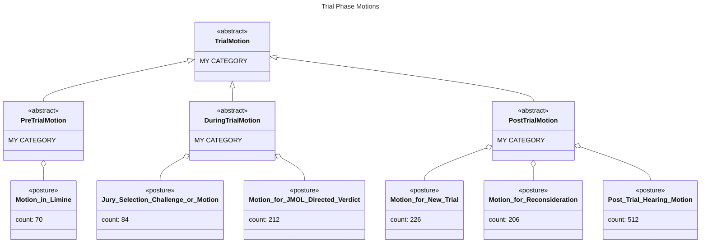
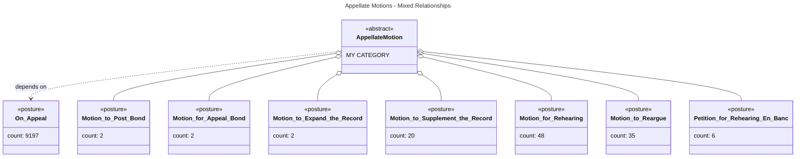
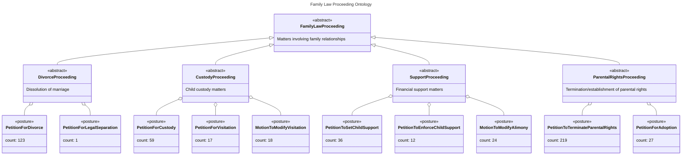
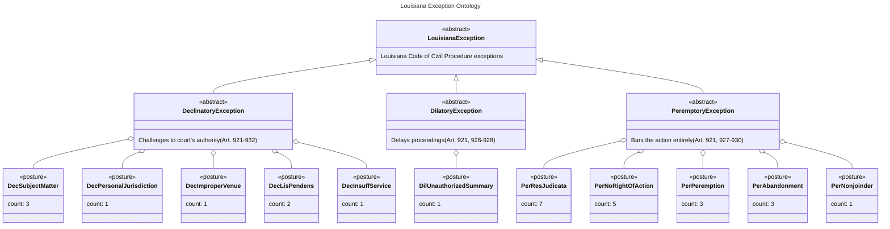

# Legal Procedural Posture Ontology

**Thomson Reuters Data Science Challenge**  
**Domain Model for Judicial Opinion Classification**

---

## 1. Executive Summary

This document presents a **legal domain ontology** for the 224 procedural posture labels in the TR dataset. The key insight is that these labels are **NOT hierarchically related via IS-A inheritance**, but rather represent **orthogonal facets** of a case's procedural state that combine compositionally.

### Key Ontological Insight

```
A document labeled ["On Appeal", "Motion to Post Bond"] does NOT mean:
  ❌ "Motion to Post Bond" IS-A "On Appeal"

It MEANS:
  ✅ The case is IN THE CONTEXT OF "On Appeal" (Stage)
  ✅ AND the specific action is "Motion to Post Bond" (Motion)
```

---

## 1.1 Diagram Conventions

### UML Relationships (Mermaid syntax)


| Syntax | Arrow | Meaning |
|--------|-------|---------|
| `<\|--` | ◁── solid + closed triangle | IS-A (inheritance) |
| `..>` | ←┄┄ dashed + open arrow | DEPENDS-ON |
| `o--` | ◇── solid + open diamond | HAS (aggregation) |
| `-->` | ←── solid + open arrow | Association |

### Data vs. Ontology
| Marker | Meaning |
|--------|---------|
| `<<abstract>>` | **My organizational category** - NOT in the data |
| `<<posture>>` | **ACTUAL label from the dataset** (224 total) |

---

## 2. The Multi-Dimensional Posture Model

The posture labels encode **multiple orthogonal dimensions**:


---

## 3. Stage Dimension (Litigation Lifecycle)

The **Stage** dimension represents where the case is in the litigation lifecycle.


**Actual posture names in data:**
- "On Appeal" (9,197)
- "Appellate Review" (4,652)
- "Review of Administrative Decision" (2,773)
- "Certified Question" (72)

---

## 4. Motion Type Dimension (Procedural Actions)

**Motions** are formal requests to the court for specific rulings. They represent ACTIONS, not states.

### 4.1 Dismissal Motions


**Actual posture names in data:**
- "Motion to Dismiss" (1,679)
- "Motion to Dismiss for Lack of Subject Matter Jurisdiction" (343)
- "Motion to Dismiss for Lack of Personal Jurisdiction" (204)
- "Motion to Dismiss for Lack of Standing" (137)
- "Motion to Dismiss for Lack of Jurisdiction" (124)

### 4.2 Trial Phase Motions



### 4.3 Appellate-Specific Motions (DEPENDENCY on Stage)



**Actual posture names in data:**
- "On Appeal" (9,197)
- "Motion to Post Bond" (2)
- "Motion for Appeal Bond" (2)
- "Motion to Expand the Record" (2)
- "Motion to Supplement the Record" (20)
- "Motion for Rehearing" (48)
- "Motion to Reargue" (35)
- "Petition for Rehearing En Banc" (6)

### 4.4 Injunction Motions


---

## 5. Specialized Proceeding Types

### 5.1 Family Law Proceedings



### 5.2 Criminal Proceedings


### 5.3 Bankruptcy Proceedings


---

## 6. Louisiana Civil Law Exceptions

Louisiana, as a civil law jurisdiction, uses distinct procedural terminology:



---

## 7. Relationship Summary Diagram


---

## 8. Implications for Modeling

### 8.1 Why This Matters for ML

1. **Not 224 independent labels** - Labels have structure
2. **Constraint satisfaction** - Some combinations are impossible
3. **Hierarchical loss functions** - Errors within a family are less severe
4. **Multi-task learning** - One head per dimension

### 8.2 Suggested Label Factorization


### 8.3 Constraint Rules (Pseudo-code)

```python
# Appellate motions require appellate stage
if "Motion to Post Bond" in predictions:
    assert "On Appeal" in predictions or "Appellate Review" in predictions

# Criminal phase motions are mutually exclusive
assert not ("Sentencing Phase" in predictions and "Trial Phase" in predictions)

# Louisiana exceptions only in Louisiana courts
if any(p.startswith("Peremptory Exception") for p in predictions):
    assert jurisdiction == "Louisiana"
```

---

## 9. Top 30 Postures Classified

| Rank | Posture | Count | Dimension | Subcategory |
|------|---------|-------|-----------|-------------|
| 1 | On Appeal | 9,197 | **Stage** | Appellate |
| 2 | Appellate Review | 4,652 | **Stage** | Appellate |
| 3 | Review of Administrative Decision | 2,773 | **Stage** | Administrative |
| 4 | Motion to Dismiss | 1,679 | **Motion** | Dismissal |
| 5 | Sentencing or Penalty Phase Motion | 1,342 | **Proceeding+Motion** | Criminal |
| 6 | Trial or Guilt Phase Motion | 1,097 | **Proceeding+Motion** | Criminal |
| 7 | Motion for Attorney's Fees | 612 | **Motion** | Fees/Costs |
| 8 | Post-Trial Hearing Motion | 512 | **Motion** | Post-Trial |
| 9 | Motion for Preliminary Injunction | 364 | **Motion** | Injunction |
| 10 | Motion to Dismiss (SMJ) | 343 | **Motion** | Dismissal |
| 11 | Motion to Compel Arbitration | 255 | **Motion** | ADR |
| 12 | Motion for New Trial | 226 | **Motion** | Post-Trial |
| 13 | Petition to Terminate Parental Rights | 219 | **Proceeding** | Family Law |
| 14 | Motion for JMOL/Directed Verdict | 212 | **Motion** | Trial |
| 15 | Motion for Reconsideration | 206 | **Motion** | Post-Ruling |
| 16 | Motion to Dismiss (Personal Jx) | 204 | **Motion** | Dismissal |
| 17 | Motion for Costs | 168 | **Motion** | Fees/Costs |
| 18 | Juvenile Delinquency Proceeding | 146 | **Proceeding** | Criminal/Juvenile |
| 19 | Motion for Default Judgment | 143 | **Motion** | Default |
| 20 | Motion to Dismiss (Standing) | 137 | **Motion** | Dismissal |
| 21 | Motion to Dismiss (Jurisdiction) | 124 | **Motion** | Dismissal |
| 22 | Motion to Transfer Venue | 124 | **Motion** | Venue |
| 23 | Petition for Divorce/Dissolution | 123 | **Proceeding** | Family Law |
| 24 | Motion for Protective Order | 116 | **Motion** | Discovery |
| 25 | Motion for Contempt | 116 | **Motion** | Enforcement |
| 26 | Motion for Permanent Injunction | 108 | **Motion** | Injunction |
| 27 | Motion to Set Aside or Vacate | 101 | **Motion** | Post-Judgment |
| 28 | Jury Selection Challenge | 84 | **Motion** | Trial |
| 29 | Motion to Renew | 74 | **Motion** | Procedural |
| 30 | Certified Question | 72 | **Stage** | Appellate |

---

## 10. Conclusion

The Thomson Reuters posture taxonomy is a **multi-faceted labeling system** that combines:

1. **Stage** (where in litigation) - mostly mutually exclusive
2. **Motion Type** (what action) - can have multiple
3. **Proceeding Type** (legal domain) - usually one
4. **Procedural Event** (what happened) - can have multiple

The **REQUIRES** relationship (e.g., Motion to Post Bond → On Appeal) is **NOT** inheritance but **contextual dependency**. This has significant implications for modeling approaches.

---

*Document generated: January 2026*  
*For Thomson Reuters Data Science Challenge*
