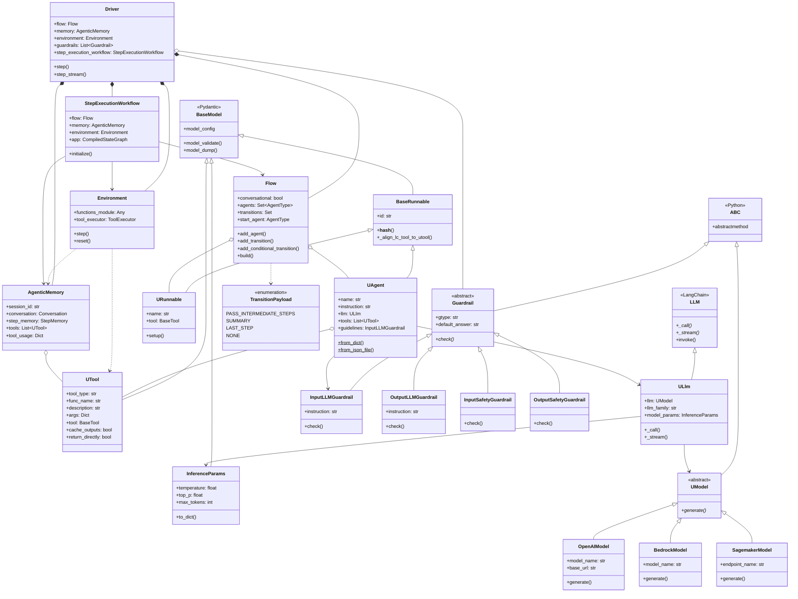
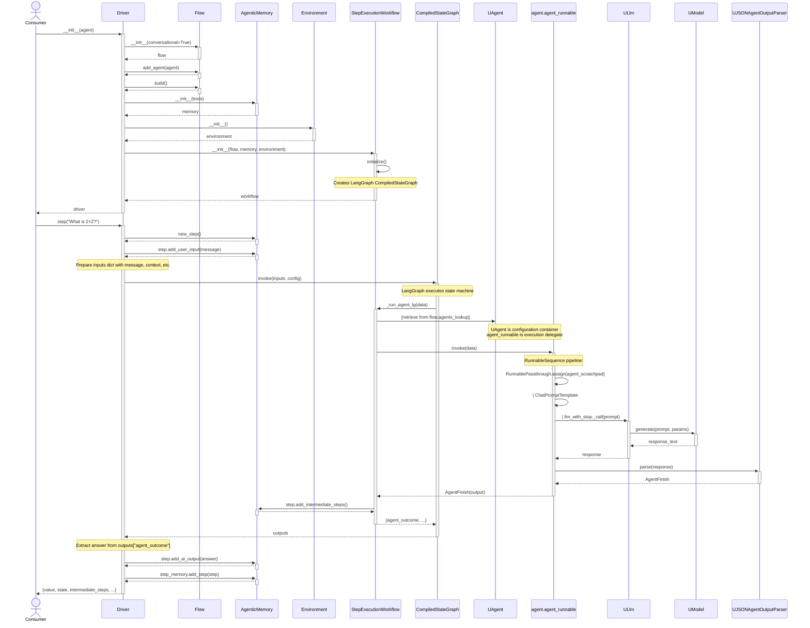
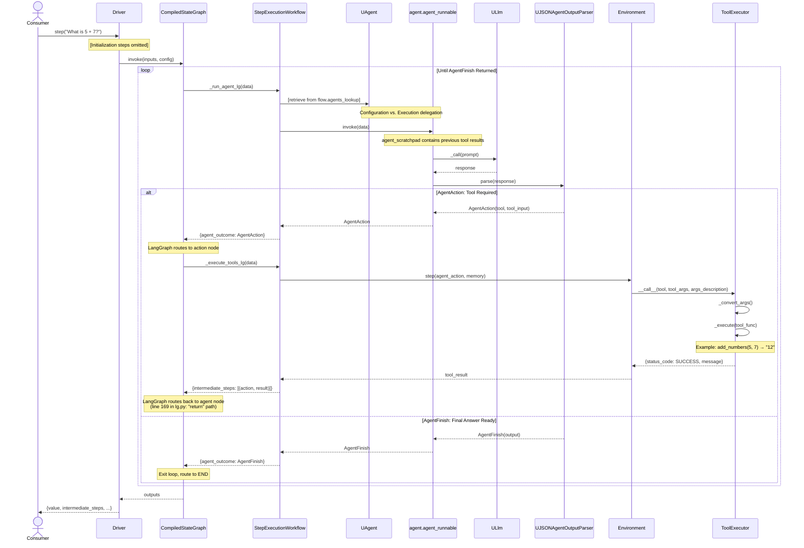

# uAgents Framework - Architecture Documentation

**Version**: 2.0.0

---

## 1. Static Architecture - High-Level Class Diagram

### 1.1 Core Inheritance Hierarchies

The framework is built on three main inheritance trees:

1. **Pydantic BaseModel** → Data validation and configuration
2. **LangChain LLM** → Model abstraction
3. **Python ABC** → Abstract interfaces for extensibility

### 1.2 High-Level Class Diagram




### 1.3 Core Components

#### Pydantic BaseModel Hierarchy
Foundation for all validated configuration objects:

- **BaseRunnable**: Base for executable components (agents, runnables)
- **UAgent**: LLM-powered decision-making agent
- **URunnable**: Deterministic code block wrapper
- **UTool**: Tool specification with validation
- **InferenceParams**: LLM generation parameters

#### LangChain LLM Hierarchy
Integration with LangChain ecosystem:

- **ULlm**: Model-agnostic LLM wrapper extending LangChain's LLM base

#### ABC Hierarchy
Extensible abstract interfaces:

- **UModel**: Abstract base for LLM providers (OpenAI, Bedrock, SageMaker, etc.)
- **Guardrail**: Abstract base for validation rules (Input/Output, LLM/Regex/Safety)

#### Orchestration Layer (Plain Classes)
Runtime execution and state management:

- **Driver**: Central orchestrator, facade for framework
- **Flow**: Multi-agent workflow definition and compilation
- **Environment**: Tool execution context
- **AgenticMemory**: Conversation and execution state
- **StepExecutionWorkflow**: LangGraph state machine executor

---

### 1.4 Key Architectural Patterns

| Pattern | Implementation | Purpose |
|---------|---------------|---------|
| **Template Method** | BaseRunnable → UAgent/URunnable | Standardized agent/runnable lifecycle |
| **Strategy** | UModel implementations | Pluggable LLM providers |
| **Adapter** | ULlm wraps various LLMs | Unified interface for heterogeneous models |
| **Facade** | Driver | Simplifies complex workflow execution |
| **Chain of Responsibility** | Guardrail list processing | Sequential validation pipeline |
| **State Machine** | StepExecutionWorkflow | Agent transition management |
| **Composition over Inheritance** | Driver composition | Flexible runtime assembly |

---

### 1.5 Dependency Flow

```
Consumer
   ↓
Driver (Facade)
   ├→ Flow (contains UAgent/URunnable)
   │    └→ UAgent → ULlm → UModel
   ├→ AgenticMemory (state tracking)
   ├→ Environment (tool execution)
   └→ Guardrails (validation)
```

---

### 1.6 Design Principles

1. **Pydantic-first**: All configuration objects inherit from BaseModel for validation
2. **ABC for extensibility**: Abstract classes define extension points (UModel, Guardrail)
3. **LangChain compatibility**: ULlm extends LangChain's LLM for ecosystem integration
4. **Composition in orchestration**: Driver, Flow, Environment use composition, not inheritance
5. **Clear separation**: Configuration (Pydantic) vs. Runtime (Plain Classes) vs. Extensions (ABC)

---

## 2. Dynamic Architecture - Sequence Diagrams

### 2.1 Single Agent Execution Flow

This diagram shows the complete execution flow for a basic single-agent interaction without tools.



### 2.2 Agent Execution with Tool Call

This diagram shows the iterative loop when an agent uses tools. The LangGraph state machine loops until the agent returns `AgentFinish`.



### 2.3 Key Observations

#### Configuration vs. Execution Separation
The framework employs a two-layer architecture following the **Proxy/Delegate pattern**:

**Configuration Layer (UAgent)**:
- Pydantic BaseModel holding design-time configuration: `name`, `instruction`, `llm`, `tools`, `guidelines`
- Acts as a factory: `setup()` method creates the execution delegate (line 249-267 in agent.py)
- Can be serialized, validated, stored (JSON/dict)
- Lives in `flow.agents_lookup` as a registry of agent configurations

**Execution Layer (agent.agent_runnable)**:
- LangChain `RunnableSequence` created by `create_structured_chat_agent()` (line 273-294 in agent.py)
- Stateless pipeline that transforms inputs to outputs
- Runtime-only construct (cannot be serialized)
- Does the actual work of prompting LLM and parsing responses

**At Runtime** (line 246-255 in lg.py):
```python
agent = self.flow.agents_lookup[data['current_agent']]  # Retrieve config
agent_outcome = agent.agent_runnable.invoke(data)        # Delegate execution
```

This separation enables:
- Clean serialization boundary (config vs. runtime)
- Pydantic validation for configuration
- LangChain ecosystem integration for execution
- Testability (can test config and execution separately)

#### Agent Runnable Pipeline (Line 286-293 in agent.py)
The `agent.agent_runnable` is a LangChain `RunnableSequence` composed of:
1. **RunnablePassthrough.assign(agent_scratchpad)** - Adds previous tool results to context
2. **| ChatPromptTemplate** - Formats the prompt with instructions, tools, context
3. **| llm_with_stop** - Invokes ULlm with stop sequences
4. **| UJSONAgentOutputParser** - Parses output into AgentAction or AgentFinish

#### LangGraph State Machine
The `StepExecutionWorkflow` compiles the Flow into a LangGraph `CompiledStateGraph` which:
- Routes between agent nodes and action (tool execution) nodes
- Manages state transitions based on AgentAction vs AgentFinish
- Loops until AgentFinish is returned

#### LangGraph Iterative Loop
The `CompiledStateGraph` implements a state machine with conditional routing (lines 89-105, 168-180 in lg.py):

**Loop Structure**:
1. **Agent Node** invokes `_run_agent_lg()` → returns `AgentAction` or `AgentFinish`
2. **Conditional Routing** (line 89-96):
   - If `AgentAction` → route to **Action Node**
   - If `AgentFinish` → route to **END** (exit loop)
3. **Action Node** invokes `_execute_tools_lg()` → executes tool
4. **Return Path** (line 169) → routes back to **Agent Node** with tool result in `intermediate_steps`
5. **Loop continues** until agent returns `AgentFinish`

This enables:
- **Multi-tool workflows**: Agent can call multiple tools sequentially
- **Reasoning loops**: Agent can analyze tool results and decide next action
- **Dynamic tool chaining**: Agent determines tool order at runtime based on results

---

## Next Sections

- **Section 3**: Extension Points
- **Section 4**: Deployment Patterns

---

## File Locations

```
src/uagents/
├── entity/
│   ├── base.py          # BaseRunnable
│   ├── agent.py         # UAgent
│   ├── runnables.py     # URunnable
│   └── guardrail.py     # Guardrail hierarchy
├── llm/
│   ├── base.py          # ULlm
│   ├── models.py        # UModel hierarchy
│   └── inference.py     # InferenceParams
├── tools/
│   └── tool.py          # UTool
├── executors/
│   └── drivers.py       # Driver
├── workflows/
│   ├── flows.py         # Flow, TransitionPayload
│   └── lg.py            # StepExecutionWorkflow
├── environments/
│   └── base.py          # Environment
└── memory/
    └── memory.py        # AgenticMemory
```
